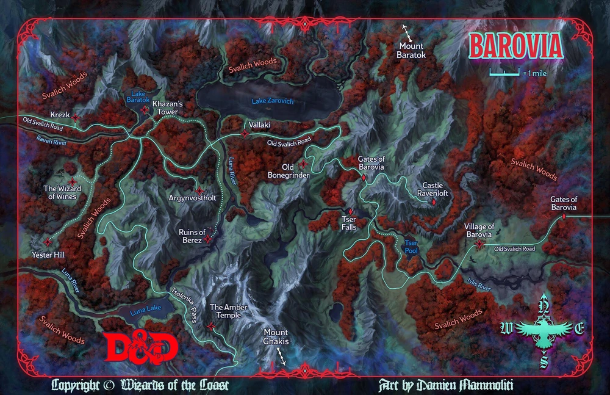

# Lugares

* [Viejo camino de Svalich](/notes/viejo-camino-de-svalich)
* [Puertas de Barovia](/notes/puertas-de-barovia)
* [Bosques de Svalich](/notes/bosques-de-svalich)
* [Rio Ivlis](/notes/rio-ivlis)
* [Aldea de Barovia](/notes/geografia/aldea-de-barovia)
* [Encrucijada del Rio Ivlis](/notes/encrucijada-del-rio-ivlis)
* [Campamento de la Laguna Tser](/notes/campamento-de-la-laguna-tser)
* [Cataratas Tser](/notes/cataratas-tser)
* [El carruaje negro](/notes/el-carruaje-negro)
* [Puertas de Ravenloft](/notes/puertas-de-ravenloft)
* [Castillo de Ravenloft](/notes/castillo-de-ravenloft)
* [Lago Zarovich](/notes/lago-zarovich)
* [El Mago logo del monte Baratok](/notes/el-mago-logo-del-monte-baratok)
* [Pueblo de Vallaki](/notes/geografia/vallaki)
* [El Molino](/notes/geografia/el-viejo-machacahuesos)
* [Encrucijada del Rio Luna](/notes/encrucijada-del-rio-luna)
* [Argynvostholt](/notes/argynvostholt)
* [Encrucijada del Rio Cuervo](/notes/encrucijada-del-rio-cuervo)
* [Aldea de Kresk](/notes/geografia/kresk)
* [Paso de Tsolenka](/notes/paso-de-tsolenka)
* [Ruinas de Berez](/notes/ruinas-de-berez)
* [Torre de Van Ritchen](/notes/torre-de-van-ritchen)
* [El Mago de los Vinos](/notes/el-mago-de-los-vinos)
* [El Templo de Ambar](/notes/el-templo-de-ambar)
* [Colina del Ayer](/notes/colina-del-ayer)
* [Cubil de los Hombres Lobo](/notes/cubil-de-los-hombres-lobo)
*
